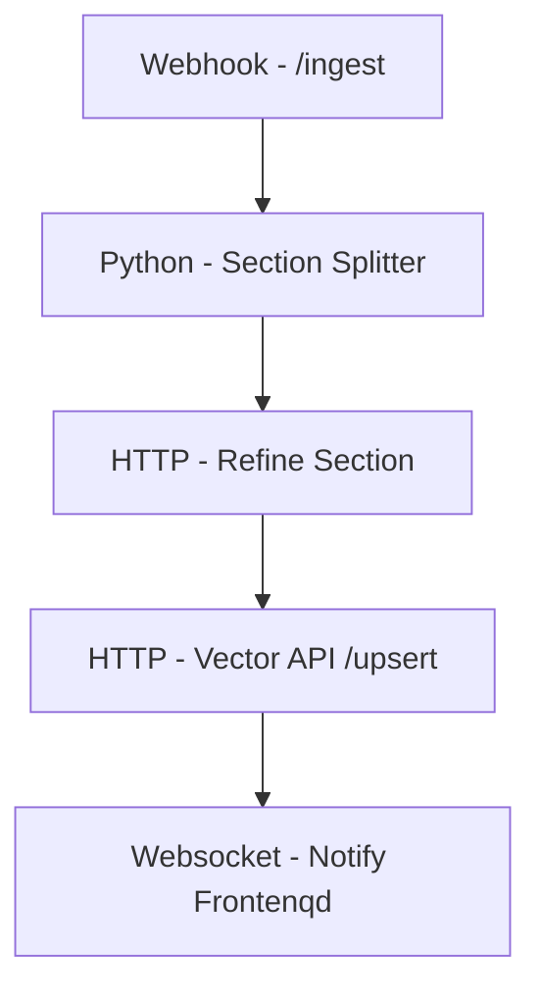

```mermaid
graph TD
    A[Webhook - /ingest] --> B[Python - Section Splitter]
    B --> C[HTTP - Refine Section]
    C --> D[HTTP - Vector API /upsert]
    D --> E[Websocket - Notify Frontenqd]
```
